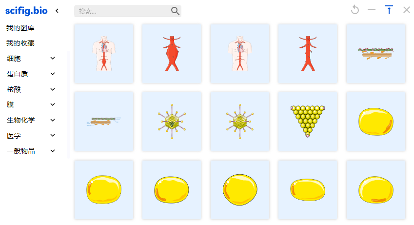
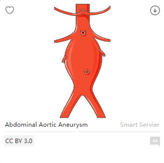

# Material Library

Our material library provides thousands of material which can be reused in your research.

You can access the figure by clicking on it, and you'll see a popup card figure. In this card, you can check the name, citation criteria, and library. Besides, there are two buttons. On the **left top**, you can add it as your favorite. On the **right top**, you are able to download it.

