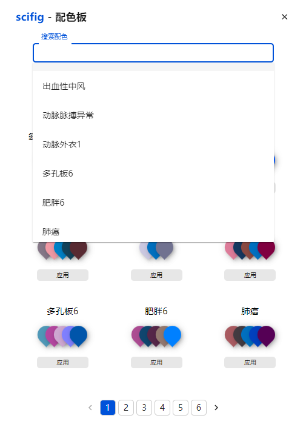

# Palette

The palette provides some typical color sets for biology researchers. You can search the colors in the search bar, or browse them page by page. By **clicking
"apply" button**, you are able to insert color sets to current slides for later use.

